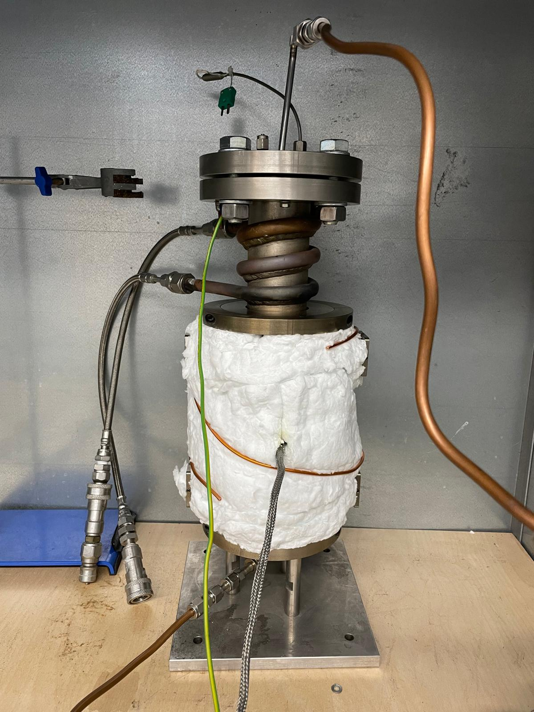
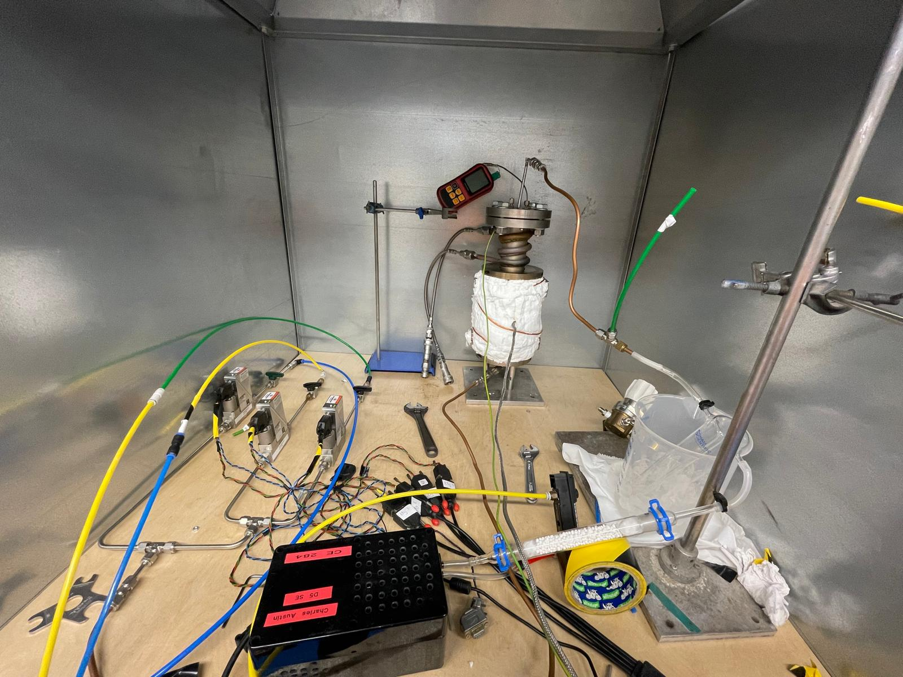

My Master Dissertation, for the MPhil in Energy Technologies at the University of Cambridge required me to design and build a Packed Bed Reactor for the production of Hydrogen. This project is a basic prototype and demo for a small start up at the University of Cambridge, which aims to produce H2 by recycling waste gases. I was required to design, characterise (via X-Ray), and test (using a ThermoGravimetric Analyser) a variety of oxygen carriers, to compare their H2 producing abilites. Furthermore, I set up the reactor, along with programming and calibrating the Gas Flow Injection system using a Rasberry Pi, and analysed the exhuast gas composition using thermal conductivity detectors and sending the information to Rasberry Pi through analog communication. 

Please review my final report in this repository 'demodraft.pdf'. If you have any questions about my work or chemical looping - please do reach out!

The 2 photos below show part of my reactor set up. The first picture is the Packed Bed Reactor, which contains the Oxygen Carriers.

